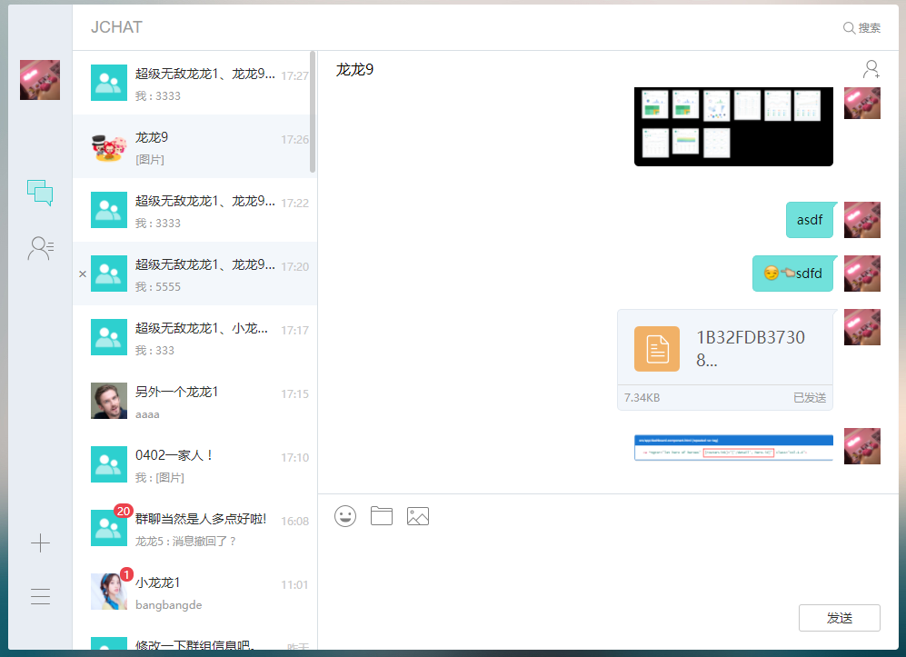

# JChat-web


		
### 简介

JChat 是基于 JMessage SDK 带有完整 UI 界面的即时通讯应用。 演示了完整的即时通讯功能，包括：

* 单聊、群聊、会话列表、好友、通讯录；
* 支持发送文本、图片、语音、表情、位置、小视频；
* 提供用户管理、群组管理、黑名单、免打扰、消息漫游等功能；

JChat 同时具备好友模式和无好友模式：

* 无好友模式：无需将对方加为好友，通过搜索对方的用户名可直接发起聊天。
* 好友模式：可申请将对方加为好友，对方会收到好友验证，验证通过则互为好友关系。

目前已覆盖 [Android](https://github.com/jpush/jchat-android) 、 [iOS](https://github.com/jpush/jchat-swift) 和 web 平台，开发者可参照 JChat 快速打造自己的 APP，提高开发效率。


### 应用截图



### 环境配置

前提：安装 node 

web jchat安装和用法：

```
npm install
```
```
npm run dll
```
```
npm run dev
```
打开浏览器：
localhost:3000

### 备注
* 整个应用使用Angular2 + webpack + gulp的技术栈，使用了Angular2中的ngrx去管理应用状态
* 当前是jchat-web v1.0.0版本，暂无好友、免打扰等功能，相关功能将在v2.0.0实现
* 业务事件消息，如群聊成员入群消息等，目前实现方法较为复杂，在js sdk更新版本后，v2.0.0将重写相关功能
* 浏览器兼容性: IE11+ ， Chrome ， Firefox ， Safari，后续考虑兼容IE10

### JMessage 文档

* [JMessage web 开发指南](https://docs.jiguang.cn/jmessage/client/im_sdk_js_v2/)